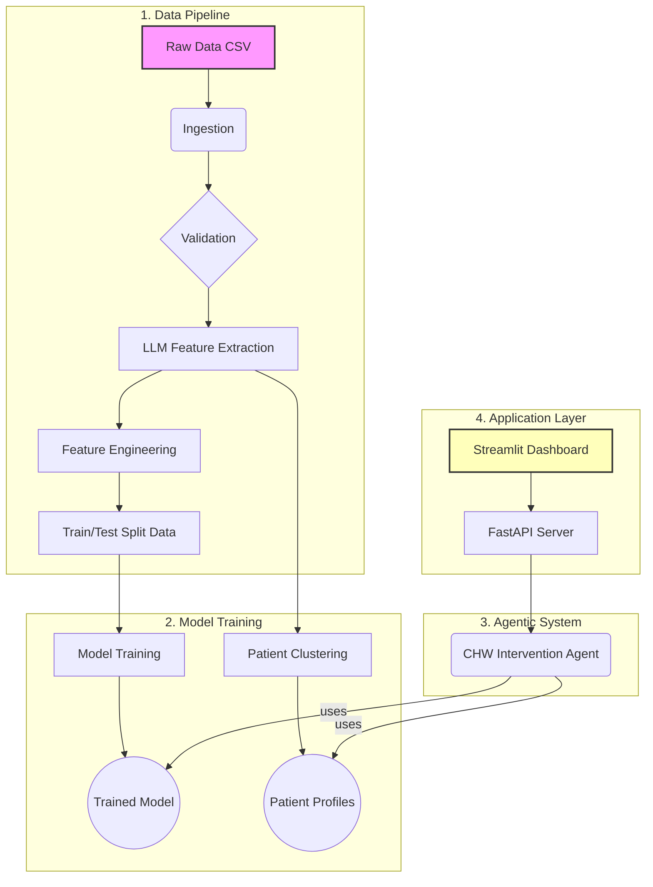

# VertexCare: An AI-Powered Intervention Platform

**VertexCare** is a production-grade MLOps project that translates published academic research into a real-world system for improving patient outcomes. It moves beyond simple prediction to create an intelligent, agentic platform that analyzes patient data, identifies high-risk individuals, and generates prioritized, actionable intervention plans for healthcare providers.

This project demonstrates a full-cycle, research-to-impact workflow, incorporating modern AI engineering principles, including a modular architecture, automated CI/CD, and state-of-the-art LLM-based feature extraction.

---
## Demos

- **Live API Endpoint**
  Try it on Google Cloud Run:
  [Generate Plan API](https://vertexcare-api-678532812483.us-central1.run.app/generate_plan)

- **Demo Animation**
  

---

## Architecture Overview

The VertexCare system is built on a modular, scalable architecture designed for reproducibility and maintainability. The diagram below illustrates the end-to-end workflow, from raw data to the final user interface.



## 1. Data Processing Pipeline (/vertexcare/data_processing):

A multi-stage pipeline that ingests raw data, validates it against a defined schema, and prepares it for feature engineering.

## 2. AI Feature Engineering (/vertexcare/features):

This component includes two key stages:

- **LLM Feature Extractor**:
Uses the Gemini API to analyze unstructured CHW notes and extract structured features (e.g., transportation issues, financial concerns, patient sentiment).

- **Feature Builder**:
Creates the final, model-ready datasets by imputing missing values and splitting the data into training and testing sets.

## 3. ML Modeling (/vertexcare/models):

- **Training**: A flexible, configuration-driven pipeline that can train multiple models (Logistic Regression, Random Forest, XGBoost) and tracks each experiment.

- **Clustering**: A K-Means pipeline that groups patients into actionable profiles based on their clinical and social data.

## 4. Agentic System (/vertexcare/agents): The core of the system.

- **Tools**: A suite of tools that allow the agent to get predictions, explanations (via SHAP), and patient notes.

- **Agent**: A "ReAct" (Reasoning and Acting) agent that uses these tools to autonomously analyze a patient case and generate a final intervention plan.

## 5. API & Dashboard (/vertexcare/api & dashboard.py):

- **FastAPI Server**: Exposes the agent's logic via a secure, scalable API endpoint.

- **Streamlit UI**: A simple, user-friendly web dashboard that allows a user to enter a patient ID and receive the agent's generated plan.

# Getting Started (with Makefile v6)

Follow these instructions to set up and run the VertexCare project locally using the provided Makefile.

---

## **Prerequisites**
- Python 3.8+
- pip and venv
- (Optional, for API/dashboard) Poetry

---

## **1. Clone the Repository**
```bash
git clone <your-repository-url>
cd vertex-care
```

---

## **2. Set Up the Virtual Environment**
Create and activate a Python virtual environment:
```bash
python -m venv venv
source venv/bin/activate
```

---

## **3. Install Dependencies**
Use Make to install dependencies (uses pip by default):
```bash
make setup
```
*(If using Poetry, uncomment the relevant lines in the Makefile.)*

---

## **4. Run the Pipeline (Full Workflow)**
To run the entire data pipeline, training, clustering, and routing (excluding notebooks), just run:
```bash
make all
```
This will:
- Lint the code
- Run unit tests
- Add mock notes
- Run the main pipeline
- Run clustering
- Run routing

---

## **5. Run Individual Steps**
If you want to run individual steps:
```bash
make add-mock-notes    # Add mock notes to data
make train             # Run main pipeline script
make clustering        # Run clustering pipeline
make routing           # Run routing pipeline
```

---

## **6. Serve the Application**
To serve the backend API (FastAPI):
```bash
make serve-api
```
To serve the frontend dashboard (Streamlit):
```bash
make serve-ui
```

---

## **7. Set Up Credentials**
This application requires Google Cloud credentials to access the Gemini API and Secret Manager.
```bash
gcloud auth application-default login
```

---

## **8. Run Tests**
To run automated unit tests:
```bash
make test
```

---

## **9. Clean Up Artifacts**
To remove generated files, models, and caches:
```bash
make clean
```

---

## **10. Get Help**
To list all available Makefile targets:
```bash
make help
```

---

## License
This project is licensed under the MIT License. See the [LICENSE file](#LICENSE) for more details.
