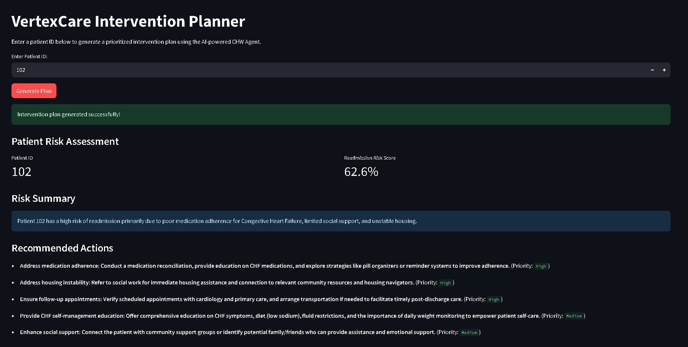
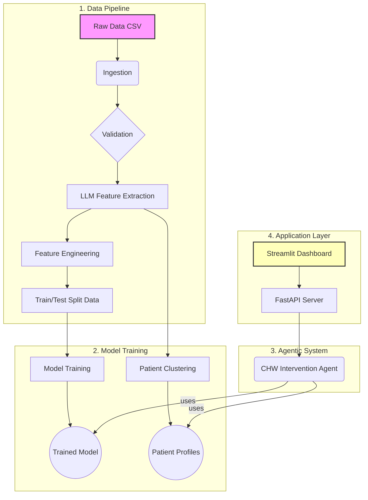

# VertexCare: An AI-Powered Intervention Platform

[](https://github.com/shilpamusale/vertex-care/actions/workflows/ci.yml) 
[](https://github.com/psf/black) 
[](https://opensource.org/licenses/MIT) 
[](https://www.python.org/downloads/release/python-380/)

**VertexCare** is a production-grade MLOps project that translates published academic research into a real-world system for improving patient outcomes. It moves beyond simple prediction to create an intelligent, agentic platform that analyzes patient data, identifies high-risk individuals, and generates prioritized, actionable intervention plans for healthcare providers.

This project demonstrates a full-cycle, research-to-impact workflow, incorporating modern AI engineering principles, including a modular architecture, automated CI/CD, and state-of-the-art LLM-based feature extraction.

---

## Live Demo 🚀

<a href="https://vertexcare-ui-678532812483.us-central1.run.app" target="_blank" rel="noopener noreferrer">
    
</a>



---

## Key Features ✨

* **End-to-End MLOps**: A complete, automated pipeline from data ingestion and validation to model training, deployment, and monitoring.
* **LLM-Powered Feature Engineering**: Leverages Gemini to extract structured insights from unstructured clinical notes, enriching the dataset.
* **Agentic System**: Implements a "ReAct" (Reasoning and Acting) agent that can autonomously use tools to analyze cases and generate comprehensive plans.
* **Microservice Architecture**: Decoupled FastAPI (backend) and Streamlit (frontend) services running on Cloud Run for independent scaling and deployment.
* **CI/CD Automation**: GitHub Actions workflow for automated testing, containerization, and deployment to Google Cloud.

---

## Architecture Overview

The VertexCare system is built on a modular, scalable architecture designed for reproducibility and maintainability. The diagram below illustrates the end-to-end workflow, from raw data to the final user interface.



## 1. Data Processing Pipeline (`/vertexcare/data_processing`):

A multi-stage pipeline that ingests raw data, validates it against a defined schema, and prepares it for feature engineering.

## 2. AI Feature Engineering (`/vertexcare/features`):

This component includes two key stages:

-   **LLM Feature Extractor**:
    Uses the Gemini API to analyze unstructured CHW notes and extract structured features (e.g., transportation issues, financial concerns, patient sentiment).

-   **Feature Builder**:
    Creates the final, model-ready datasets by imputing missing values and splitting the data into training and testing sets.

## 3. ML Modeling (`/vertexcare/models`):

-   **Training**: A flexible, configuration-driven pipeline that can train multiple models (Logistic Regression, Random Forest, XGBoost) and tracks each experiment.

-   **Clustering**: A K-Means pipeline that groups patients into actionable profiles based on their clinical and social data.

## 4. Agentic System (`/vertexcare/agents`): The core of the system.

-   **Tools**: A suite of tools that allow the agent to get predictions, explanations (via SHAP), and patient notes.

-   **Agent**: A "ReAct" (Reasoning and Acting) agent that uses these tools to autonomously analyze a patient case and generate a final intervention plan.

## 5. API & Dashboard (`/vertexcare/api` & `dashboard.py`):

-   **FastAPI Server**: Exposes the agent's logic via a secure, scalable API endpoint.

-   **Streamlit UI**: A simple, user-friendly web dashboard that allows a user to enter a patient ID and receive the agent's generated plan.

## Local Setup and Development

Follow these instructions to set up and run the VertexCare project locally using the provided `Makefile`.

-   **Prerequisites**
    -   Python 3.8+
    -   `make` command-line tool
    -   A Python virtual environment tool (like `venv`)

### 1. Clone the Repository
```bash
git clone <your-repository-url>
cd vertex-care
```

### 2. Install Dependencies
It's recommended to create and activate a Python virtual environment first. Then, you can install all required packages with a single command.

```bash
# Recommended: Create and activate a virtual environment
python -m venv venv
source venv/bin/activate

# Install all dependencies
make setup
```

### 3. Set Up Credentials
This application requires Google Cloud credentials to access Vertex AI services.

```bash
gcloud auth application-default login
```

### 4. Run the Application
The backend API and the frontend UI are run as separate services. You'll need two separate terminals.

**In Terminal 1 (Backend API):**
This command starts the FastAPI server.
```bash
make serve-api
```

**In Terminal 2 (Frontend UI):**
This command starts the Streamlit dashboard.
```bash
make serve-ui
```
You can now open the Streamlit URL shown in Terminal 2 to use the planner.

## Running the MLOps Pipelines

These commands execute the offline data processing and model training jobs. The resulting models and data artifacts are used by the live application.

### Running All Pipelines at Once
The `all` target provides an end-to-end run that checks code quality, runs tests, and executes all data and modeling pipelines in the correct order.

```bash
make all
```

### Running Individual Pipelines
You can also run each pipeline step individually.

- **Process data and train the primary model:**
    ```bash
    make run-pipeline
    ```
- **Run the patient clustering model:**
    ```bash
    make run-clustering
    ```
- **(If needed) Add mock notes to the raw data:**
    ```bash
    make run-add-mock-notes
    ```

## Testing and Linting

You can validate your code at any time by running the automated tests and lint checks.

-   **To run the test suite:**
    ```bash
    make test
    ```
-   **To check code formatting and style:**
    ```bash
    make lint
    ```

### Discovering Other Commands
The `Makefile` includes other helpful commands. To see a full list of available targets and their descriptions, run:
```bash
make help
```

## License
This project is licensed under the MIT License. See the [LICENSE file](#LICENSE) for more details.
