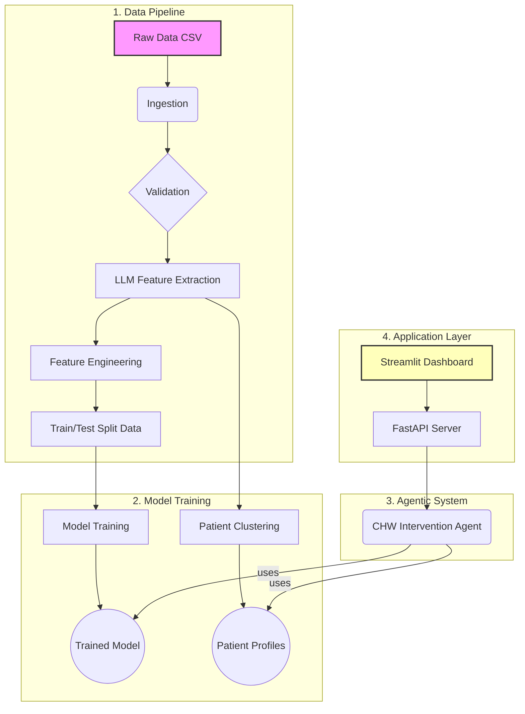

# VertexCare: An AI-Powered Intervention Platform

**VertexCare** is a production-grade MLOps project that translates published academic research into a real-world system for improving patient outcomes. It moves beyond simple prediction to create an intelligent, agentic platform that analyzes patient data, identifies high-risk individuals, and generates prioritized, actionable intervention plans for healthcare providers.

This project demonstrates a full-cycle, research-to-impact workflow, incorporating modern AI engineering principles, including a modular architecture, automated CI/CD, and state-of-the-art LLM-based feature extraction.

---

## Architecture Overview

The VertexCare system is built on a modular, scalable architecture designed for reproducibility and maintainability. The diagram below illustrates the end-to-end workflow, from raw data to the final user interface.



## 1. Data Processing Pipeline (/vertexcare/data_processing):

A multi-stage pipeline that ingests raw data, validates it against a defined schema, and prepares it for feature engineering.

## 2. AI Feature Engineering (/vertexcare/features):

This component includes two key stages:

- **LLM Feature Extractor**:
Uses the Gemini API to analyze unstructured CHW notes and extract structured features (e.g., transportation issues, financial concerns, patient sentiment).

- **Feature Builder**:
Creates the final, model-ready datasets by imputing missing values and splitting the data into training and testing sets.

## 3. ML Modeling (/vertexcare/models):

- **Training**: A flexible, configuration-driven pipeline that can train multiple models (Logistic Regression, Random Forest, XGBoost) and tracks each experiment.

- **Clustering**: A K-Means pipeline that groups patients into actionable profiles based on their clinical and social data.

## 4. Agentic System (/vertexcare/agents): The core of the system.

- **Tools**: A suite of tools that allow the agent to get predictions, explanations (via SHAP), and patient notes.

- **Agent**: A "ReAct" (Reasoning and Acting) agent that uses these tools to autonomously analyze a patient case and generate a final intervention plan.

## 5. API & Dashboard (/vertexcare/api & dashboard.py):

- **FastAPI Server**: Exposes the agent's logic via a secure, scalable API endpoint.

- **Streamlit UI**: A simple, user-friendly web dashboard that allows a user to enter a patient ID and receive the agent's generated plan.

# Getting Started
Follow these instructions to set up and run the VertexCare project locally.

- **Prerequisites**
    - Python 3.8+
    - pip and venv

- **1. Clone the Repository**
    ```Bash
    git clone <your-repository-url>
    cd vertex-care
    ```
- **2. Set Up the Virtual Environment**
Create and activate a Python virtual environment.

    ```Bash
    python -m venv venv
    source venv/bin/activate
    ```
- **3. Install Dependencies**
    Install the project and all its dependencies, including the optional testing libraries.

    ```Bash
    pip install -e ".[test]"
    ```
- **4. Run the Full ML Pipeline**
    To process the data and train the champion model (Logistic Regression), run the main pipeline script:

    ```Bash
    python run_pipeline.py --model logistic_regression
    ```

- **5. Run the Application**
    To interact with the agent, you need to run the backend API and the frontend dashboard in two separate terminals.

    In Terminal 1 (Backend):

        ```Bash
        python vertexcare/api/main.py
        In Terminal 2 (Frontend):
        ```
        ```Bash
        streamlit run dashboard.py
        Now, you can open the Streamlit URL provided in your browser to use the VertexCare Intervention Planner.
        ```
- **6. Run Tests**
    To run the automated unit tests, use the following command:

    ```Bash
    python -m pytest
    ```
<!-- ## Contributing
Contributions are welcome! If you have a suggestion or find a bug, please open an issue to discuss it.

If you would like to contribute code, please follow these steps:

Fork the repository.

Create a new feature branch (git checkout -b feat/your-amazing-feature).

Make your changes and commit them (git commit -m 'Feat: Add some amazing feature').

Push to the branch (git push origin feat/your-amazing-feature).

Open a new Pull Request. -->

## License
This project is licensed under the MIT License. See the LICENSE file for more details.
